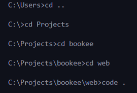
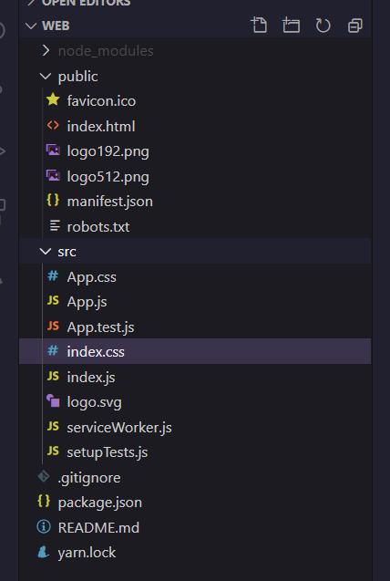

## Como criar um projeto React e React Native
[](README.md)

Este tutorial não é uma introdução detalhada sobre React e React Native. O propósito é de juntar em um só lugar os passo-a-passo e os comandos para criar um projeto, rápido e simplificado.

Sugiro ler as documentações de qualquer tecnologia que for utilizar. No começo pode parecer complicado, mas só com a documentação que realmente aprende profundamente sobre.

#### Links que pode te ajudar a começar com o React:
* [Cursos do Rocketseat](https://app.rocketseat.com.br/dashboard) e se atualizar sobre a stack lendo os artigos no deles [blog](https://blog.rocketseat.com.br/tag/reactjs/). Alguns cursos são de graça, então fica de olho;
* [Documentação do React](https://reactjs.org/docs/getting-started.html).


### Conteúdo
1. [Web (front-end)](#web)
2. [Server (back-end)](#server)
3. [Mobile usando React Native](#mobile)
4. [Contribuição e Problemas](#contribution)
5. [License](#license)

### O que precisa para começar:
Primeiro, você precisa instalar essas ferramentas:
* [Node.js](https://nodejs.org/en/);
* [NPM](https://www.npmjs.com/get-npm);
* [Yarn](https://yarnpkg.com/getting-started);
* [Expo](https://expo.io/learn).


## Web (front-end) <a name="web"></a>
Para criar o web app você precisa primeiro instalar o create-react-app. Use o seguinte comando no seu terminal de preferência:
```
npm install -g create-react-app
```

Acesse a pasta onde você deseja criar seu projeto e execute o seguinte comando (o nome do projeto é sem o `<>`):
```
create-react-app <nome-projeto>
```

Meu editor de código favorito é o Visual Studio Code, então para abrir de maneira rápida a pasta que eu quero acessar, eu entro nesta pasta pelo terminal e uso o comando `code .` para abrir.



A estrutura do projeto ficará assim:



Geralmente, deleto alguns arquivos que não irei utilizar:
* `App.css`
* `App.test.js`
* `index.css`
* `logo.svg`

O arquivo `servicerWorker.js` é para trabalhar com projetos em PWA.


## Server (back-end) <a name="server"></a>
Entre na pasta em que deseja criar o server e execute o seguinte comando:

```
mkdir server
```

Entre na pasta `server` usando o comando `cd server` e execute o comando:

```
yarn init -y
```

Agora você pode abrir a pasta. Se estiver utilizando o Visual Studio Code, use o comando `code .` para abrir.

Para concluir a configuração do projeto, você precisa instalar o Typescript. Use o seguinte comando:

```
yarn add typescript -D
```

e 

```
yarn tsc --init
```

No arquivo `tsconfig.json`, mude o `"target": "es5"` para `"target": "es2017"`. Você precisa fazer isso porque é até a versão de 2017 que tem as funcionalidades que o Node.js reconhece. 

Use o seguinte [comando](https://www.npmjs.com/package/ts-node-dev) para executar o servidor e observar se tem alguma alteração no script. Isto automatiza o processo para conseguir fazer com que o Node entenda o Typescript:

```
yarn add ts-node-dev -D
```

O `-D` significa que será usado apenas em dev e não em produção.

Em `"script"` e `"start"` o comando `--transpile-only` converte o typescript para javascript. Isso acelera o processo de aceução da aplicação. O `--ignore-watch` é o comando que faz com que esse tipo de conversão não ocorra dentro da pasta `node_modules`.

O `--respawn` faz com que o código recarrega toda fez que tiver uma alteração.

Agora, utilize os seguintes comandos:
`yarn add express` - é  um micro framework que traz alguma funcinalidades prontas.

`yearn add @types/express -D` - o express pediu para instalar já que nem todos os pacotes utilizam o typescript.

### Criando os arquivos necessários para um back-end
Crie uma pasta `src`, onde irá ficar todo o código da aplicação. 
Dentro de `src`, crie as seguintes pastas: `controllers` e `database`.

### Configurando o banco de dados
Executar comando `yarn add knex sqlite3`.
O `knex` é um query builder. Ele basicamente permite que voce esreva as querys para o SQL em JavaScript.

Crie uma pasta chamada `database` e dentro dela, crie outra pasta chamada `migrations` e um arquivo chamada `connection.ts`. A estrutura ficará assim:


Execute também o `yarn add cors` para permitir que aplicaçoes em endereços diferentes acesse a api.
Depois, utilize o `yarn add axios` para facilitar o consumo de apis externas


## 📱 Mobile using React Native <a name="mobile"></a>
[Parte mobile incompleto]
Utilize um dos seguintes comandos para criar o projeto mobile:

```
expo init mobile
```

ou 

```
expo init mobile --template "blank"
```


## 🦾 Contribution or 🐞 Issues <a name="contribution"></a>
Escrevi este pequeno tutorial para ajudar na jornada dos aventureiros de React e Node.js iniciantes. Se você tem alguma sugestão ou melhoria, sinta-se livre para abrir uma Issue ou entrar em contato comigo! Vou ficar muito feliz em receber seu pull request. 🥰


## 📃 License <a name="license"></a>
Escrito com 💙 por [Luiza R. Marinho](https://github.com/luizous).

Este tutorial está sob licença [MIT](LICENSE).